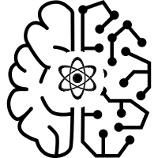

# Physics Informed Machine Learning 


Our objective is to improve machine learning (ML) methods by devising an algorithm that utilizes the laws of physics. Incorporating physics through auto-differentiation in ML has a number of benefits including the need for less data and the inclusion of well-defined physics equations. This will ultimately increase the rate of convergence and prediction accuracy. This technology will aid in directing research projects by using informed decision making in a machine learning framework, namely, reinforcement learning.  

This repository is divided into two parts, each of which explore different machine learning approaches.

### Part I: Solving the Inverted Pendulum Problem Using Reinforcement Learning (RL)
OBJECTIVE: Move a cart along a frictionless path such that the balancing pole maintains an upright position. 

*Components of RL* 
1. Agent: controls the system by preforming an action
2. Action: instructions to manipulate a system
3. Environment: response to the action
4. State: representation of the environment
5. Reward: numerical representation of the agent's decision based on the resulting environment

To solve the cartpole problem, the agent applies an action on the cart to explore the environment through a "trial-and-error" method. The agent learns the "optimal" action through a reward system using a deep Q-network (DQN).

We have improved the learning rate and convergence of solving the cartpole problem by implementing an improved reward system that considers the laws of physics.


For more information click [here](https://github.com/schr476/uw_capstone_2020/tree/master/cartpole_RL)

### Part II: Building a Physics Informed Agent for the Pendulum Problem Using Supervised Learning (SL)
OBJECTIVE: Apply the appropriate force such that a swinging pendulum reaches and maintains an upright position

In order to implement the pendulum problem in RL, we first devise a method for building a physics informed agent. This agent is trained through a labeled dataset and the nonlinear second order differential equation to better understand the behavior of the pendulum system.   
$$\frac{d^2\theta}{d^2t}+\frac{g}{l}\sin\theta=0$$

Once a network has been developed and sufficiently trained, it will be implemented in the RL framework to solve the pendulum problem.

## Directory Organization
```
cartpole_RL                            : cartpole problem using reinforcement learning (RL)
 ├── setup.py                          : python dependency info
 ├── drivers                           : a folder contains RL steering scripts
 |   └── run_dqn.py                    : steering script to debug changes in the dqn agent using cartpole en
 ├── agents                            : a folder contains agent codes
 |   └── dqn.py                        : agent used for discrete action space
 ├── cfg                               : a folder contains the agent and environment configuration
 ├── utils                             : a folder contains utilities

pendulum_SL                            : pendulum problem using supervised learning (SL) to build environment for RL
 ├ Deep_Deterministic_Policy_Gradients_notebooks
 │      ├ DDPG.ipynb
 │      ├ ddpg_agent.py
 │      └ model.py
 ├ Physics_Informed_Neural_Networks_notebooks
 │      ├ PINNs_pendulum_daniel.ipynb
 │      └ PINNs_pendulum_weishi.ipynb
 ├ pendulum_alexis
 │       ├ data				                : data sets for SL training
 │       ├ lbfgs.py			              : limited memory Broyden-Fletcher-Goldfarb-Shanno optimization algorithm
 │       ├ logs				                : collected output reports from runs
 │       ├ pinn.py			              : Physics informed neural network (NN) code
 │       ├ plot.py			              : plotting loss and predictions
 │       ├ plots			                : collected plots from plot.py
 │       ├ prep_data.py			          : work-up data for use in NN
 │       └ run_pendulum.py		        : build environment for pendulum problem

docs
  ├ Gantt_Chart.pdf
  ├ Reinforcement Learning.pdf
  └ use_cases.ipynb
```
## Software Requirement
* Python 3.7
* The cartpole environment framework and pendulum data set is built using [OpenAI Gym](https://gym.openai.com)
* Additional python packages are defined in the setup.py  

## Installing
```
git clone https://github.com/schr476/uw_capstone_2020.git

cd uw_capstone_2020

pip install -e . --user
```


## References
* Surma, G. ["Cartpole - Introduction to Reinforcement Learning (DQN - Deep Q-Learning)"](https://towardsdatascience.com/cartpole-introduction-to-reinforcement-learning-ed0eb5b58288)

* Supervised learning code built from [PINNs-TF2.0](https://github.com/pierremtb/PINNs-TF2.0)
