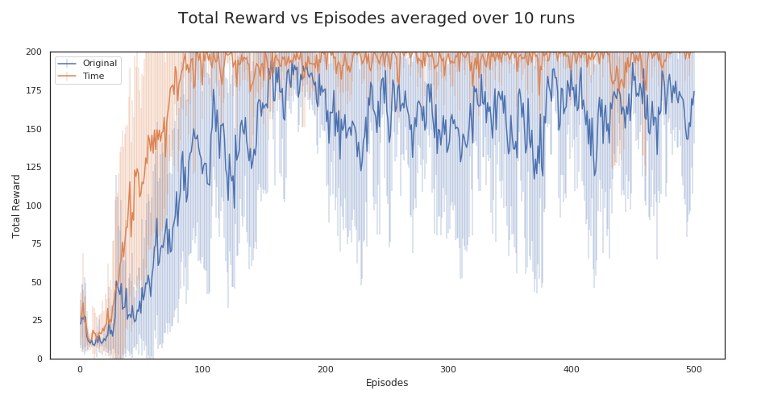

# Reinforcement Learning Agent for the Cartpole Problem

## Software Requirement
* Python 3.7
* The environment framework is built of [OpenAI Gym](https://gym.openai.com). Cartpole environment can be [found here](https://gym.openai.com/envs/CartPole-v0/).
* Packages listed in setup.py

## Introduction
> A pole is attached by an un-actuated joint to a cart, which moves along a frictionless track. The system is controlled by applying a force of +1 or -1 to the cart. The pendulum starts upright, and the goal is to prevent it from falling over. A reward of +1 is provided for every timestep that the pole remains upright. The episode ends when the pole is more than 15 degrees from vertical, or the cart moves more than 2.4 units from the center.

~ From OpenAI website

The environment outputs an "Observation" every time an "Action" is made. For this problem, "Observation" consists of cart position (x), cart velocity (x_dot), pole angle (theta), and pole angular velocity (theta_dot). There is only two "Action" available - 0 (push cart to the left) or 1 (push cart to the right). After an action is made, the environment calculates the speed and position of both the cart and pole and adjusts the situation accordingly. The environment also outputs "Reward". In the default case, the reward is 1 if the cartpole is within the constraint or 0 if it has failed. Through the use of Deep Q-Network, our model should be able to predict moves based on reward in the future. However, with the use of physics in the reward structure, we were able to accelerate convergence and stabilize overall performance.

## Instructions
1. Make sure to install the packages from `uw_capstone_2020/setup.py`
2. Run from this directory `$ cartpole_RL`
3. There are two files within drivers folder. One is `run_dqn.py`, the other `modified_run_dqn.py`. Choose which one you would like to run.
4. Run the wanted file from the current directory by using `python drivers/run_dqn.py`.

## Notes
1. There will be an update on the status of training within the console. The training length can be changed within the driver files.
2. Training parameters are obtained from the `dqn_setup.json` file within `cfg` folder.
3. The training outputs data to the `data` folder. If the data folder does not exist, an error will be thrown.

## Results
The original agent within looked at only the raw output produced by the environment, which included the simple binary reward structure. Improvements to this reward structure was made in the modified agent, where the elementary physics equations came in handy. The equation we used was the `acceleration * time = final_velocity - initial_velocity`. We applied this equation to both theta values and x values to calculate time for both components. For example, `x_dot * x_time = final_x - initial_x`, allowed us to calculate the `x_time`. To explain further, `x_time` in this case would be the time required to reach the `final_x`, which is the constraint set by the environment, from `initial_x`, the current position. This meant that action resulting in greatest `x_time` should be favored since it allows the model to balance the cartpole the longest. Same approach was applied to `theta` allowing us to retrieve `theta_time`. These two variables, `x_time` and `theta_time`, were used to calculate the reward with the use of tanh. The resulting values were then weighted to reflect the correlation coefficients. Correlation coefficients were calculated, as seen in figure 1, to investigate the impact of each variable. Absolute value of these coefficients were added to calculate the percentage for x and theta, which resulted in 0.3 and 0.7.

<figcaption> <b>Figure 1.</b> Correlation matrix for the cartpole </figcaption>  

The result was noticeable. Figure 2 compares the "Original" reward structure to the "Time" reward structure. As one can see, the time reward structure convergences to a solution around 100 episodes compared to roughly 150 in the Original structure. Furthermore, the stability of the time reward structure is much improved from the original reward structure as one can see from the variability throughout the episodes.

<figcaption> <b>Figure 2. </b> Comparison of original and modified reward structure </figcaption>
 
Now, our solution is not perfect. As we can see around 450 episodes, we still observe drops in performance and our convergence could be much faster. However, focus on the actual network architecture may provide greater improvements than modification of the reward structure. In conclusion, the incorporation of physics into the reward structure of the reinforcement learning greatly increased performance and stability of the model. Use of this technique into other networks may provide significant increase in performance as well.
